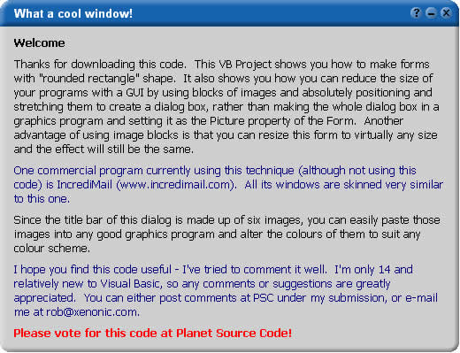



## FANTASTIC RESIZABLE skinned form demonstrating forms with non\-standard shapes

### Description

My first submission, this code is a multi-purpose skinned graphical form. Sounds pretty standard, but this one is RESIZABLE TO ANY SIZE. It teaches you how to use Regions (for shaping forms) and also how you can keep the size down of your program by using "Image Blocks" to make up skinned dialogs (positioning and streching images to make a dialog).

Take a look - it's well worth it.

And I know people always put this on their submissions, but PLEASE vote and leave comments and/or suggestions. If you're a contributer to Planet Source Code, you know how much you value feedback. If you're not a contributer, I can assure you that if you were, you too would want people to give suggestions.

Enjoy!
 
### More Info
 

             |
---                |---
**Submitted On**   |2001-08-22 17:24:56
**By**             |[Rob Wright](https://github.com/Planet-Source-Code/PSCIndex/blob/master/ByAuthor/rob-wright.md)
**Level**          |Intermediate
**User Rating**    |4.4 (168 globes from 38 users)
**Compatibility**  |VB 4\.0 \(32\-bit\), VB 5\.0, VB 6\.0
**Category**       |[Custom Controls/ Forms/  Menus](https://github.com/Planet-Source-Code/PSCIndex/blob/master/ByCategory/custom-controls-forms-menus__1-4.md)
**World**          |[Visual Basic](https://github.com/Planet-Source-Code/PSCIndex/blob/master/ByWorld/visual-basic.md)
**Archive File**   |[FANTASTIC 251378222001\.zip](https://github.com/Planet-Source-Code/rob-wright-fantastic-resizable-skinned-form-demonstrating-forms-with-non-standard-shapes__1-26531/archive/master.zip)

